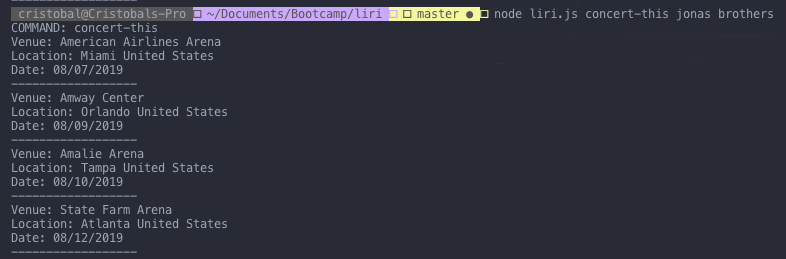
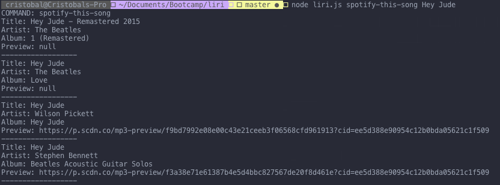
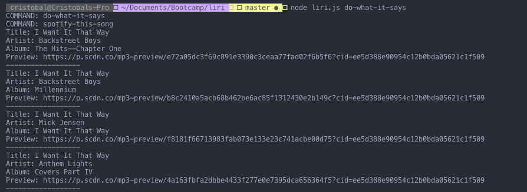

# Liri
## A Siri-like CLI application

Liri provides you with an interface in which you can quickly view data for bands, movies, and songs all in one place, at the touch of your fingertips.

### Liri uses the following API's
<ul>
  <li> Spotify
  <li> OMDB
  <li> Bandsintown
 </ul>

 

## Installation

<ol> 
  <li>
    If you don't have Node.js already you can <a href="https://nodejs.org/en/">download it here</a>
  </li>
  <li>
    Once Node is downloaded open your terminal and <code>cd</code> into the directory containing the liri.js file
  </li>
  <li> 
    Run <code>npm install</code> .This will install the required dependencies.
  </li>
  <li>Use liri by typing <code>node liri.js COMMAND</code> see below for examples and commands.</li>
</ol>

## Commands

<ul>
  <li>
    
<strong>concert-this</strong>

    
Displays concert information from the artist(s) specified.

    
  </li>
  <li>
    
<strong>spotify-this-song</strong>

    
Displays track information for the specified song

    
  </li>
  <li>
    
<strong>movie-this</strong>

    
Displays movie information for the specified movie

    
  </li>
  <li>
    
<strong>do-what-it-says</strong>

    
Performs the command specified in the random.txt file

    
  </li>
</ul>

## Notes

the main function chooses which function to call based on it's input parameters. the functions then make sure to perform the appropriate API calls.

All tasks that are performed are logged in the log.txt file.

# Enjoy!